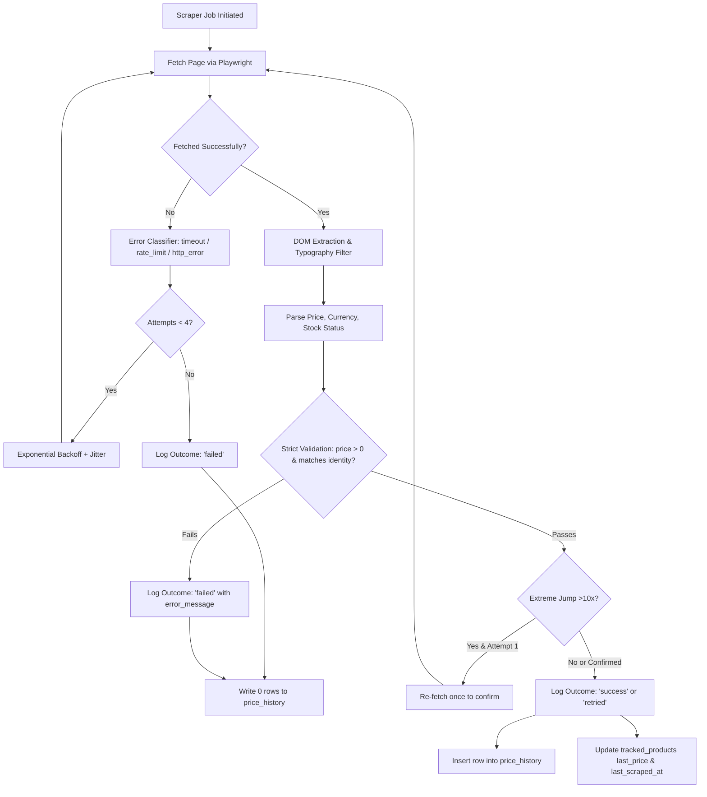

# Design Note: Product Price Tracker Architecture & Reliability Engineering

## 1. Executive Summary & Core Objective

The primary objective of this project is **unattended scraping reliability** against the INE mock store hosted at `https://demo.inelabteamdev.com`. Unlike typical web scrapers that treat scraping as an afterthought, this system is engineered with defense-in-depth:
- **Zero fake/guessed data guarantee**: If a scrape fails, timed out, or encountered a trap, exactly **zero** rows are inserted into `price_history`. An honest, auditable record is logged to `scrape_logs`.
- **Free-tier friendliness**: Designed to operate within 100% free tiers: Vercel (frontend SPA), Render (Express backend), Supabase (managed Postgres), and cron-job.org (external scheduler).
- **Transparency & observability**: Live observable headed execution (`npm run scrape:headed`), rich Recharts price trends, live manual triggers, and audit logs.

---

## 2. Scraping Architecture & Anti-Scraping Defenses

### 2.1 Why Pure HTTP Fetch Failed (The Attestation & PoW Barrier)
During initial reconnaissance, we tested whether pricing could be queried via standard HTTP `fetch` or `curl`. The endpoint `/api/session` consistently rejected requests with `401 Unauthorized {"error":"unauthorized"}`. Reverse-engineering the store's client bundle revealed:
1. **WebAssembly Proof-of-Work**: A `.wasm` module computes a cryptographic challenge (`/api/challenge`).
2. **Browser Attestation Vector (`att`)**: The client calculates:
   - Canvas fingerprinting (`ar()`)
   - WebGL hardware vendor and unmasked renderer strings (`or()`)
   - Frame rate performance profiling (`sr(8)`)
3. **Human Telemetry Physics**: The backend enforces `moves.length >= 8` and `dwellMs >= 600`. Requests without authentic mouse trajectory coordinates and duration are flagged as bots.

**Architectural Decision**: A real browser engine (Playwright Chromium) is mandatory. We reuse a shared browser instance (`sharedBrowser`) across scrapes to minimize memory overhead on Render's 512MB RAM tier, while isolating each scrape in an ephemeral `BrowserContext`.

### 2.2 Neutralizing Anti-Scraping Traps

| Trap / Anomaly | Store Behavior | Scraper Defense |
|---|---|---|
| **Decoy Price Elements** | Hidden `₹12,462` and `` | Custom DOM extractor filters elements with `display: none`, `visibility: hidden`, or strikethrough `text-decoration`. Evaluates visible elements within `.price-main` and picks typography with computed `fontSize >= 2rem`. |
| **Typography Concatenation** | Price container contains MRP (`₹15,911`), deal price (`₹12,968`), selling price (`₹10,024`), discount (`37% off`), and stock quantity | Avoids naive `container.innerText`. Strips child badges, discounts, and decoy nodes before text extraction. |
| **Flaky Click Handler (`Xn`)** | The store's button click function `Xn()` has an artificial 17.5% drop rate | After clicking, the fetcher verifies if the challenge state progressed. If still idle after 400ms, it retries clicking. |
| **IP Challenge Rate Limiting** | Rapid requests to `/api/challenge` return `HTTP 429 Too Many Requests` after ~12 calls | Concurrency capped at 2 (`p-limit`), with a polite 800ms stagger between requests and exponential backoff with full jitter. |
| **Indian & European Formats** | Prices rendered as `₹1,32,999.50`, `32.999,00 €`, or unicode numbers `３２９９９` | Parser detects separator frequency (lakhs vs thousands) and normalizes unicode fullwidth digits before float conversion. |

---

## 3. Free-Tier Scheduling & Server Architecture

### 3.1 Overcoming the 30-Second Webhook Timeout
External schedulers like cron-job.org enforce a strict 30-second HTTP request timeout. If Render is cold-starting or batch scraping 20 products takes 45 seconds, the webhook would fail.
- **Immediate `202 Accepted`**: The `POST /api/cron/scrape-all` endpoint verifies `X-CRON-SECRET`, acquires an overlap lock, creates a `scrape_runs` record, and returns `202 Accepted` within **<50ms** with `{ status: "processing", runId: "..." }`.
- **Background Async Processing**: The batch scrape executes in the background.

### 3.2 Overlap Lock & Stale-Run Recovery
- To prevent overlapping cron invocations from overwhelming Render's RAM or triggering store rate limits, `POST /api/cron/scrape-all` checks for an existing `status = 'running'` run in `scrape_runs`.
- If a previous run was abruptly killed by an OOM or container restart, any running lock older than 10 minutes is automatically classified as stale and marked `failed (stale timeout)`.

### 3.3 Spin-Up & Keep-Alive
Render's free tier spins down web services after 15 minutes of inactivity.
- `GET /api/health`: Provides a lightweight health check endpoint.
- Schedulers can ping `/api/health` every 10 minutes or hit `/api/cron/scrape-all` every 2 hours with an initial ping to wake the service.

---

## 4. Strict Validation & Honest Logging

### Invariant Table
| Condition | `scrape_logs` Entry | `price_history` Entry |
|---|---|---|
| Scrape succeeds on attempt 1 | Outcome: `success`, `extracted_price: X` | Insert `price: X, currency: INR, stock_status: ...` |
| Scrape succeeds on attempt 2-4 | Outcome: `retried`, `extracted_price: X` | Insert `price: X, currency: INR, stock_status: ...` |
| HTTP 429 Rate Limited | Outcome: `failed`, `error_type: rate_limit` | **NO ROW INSERTED** |
| Product Title Mismatch | Outcome: `failed`, `error_type: structure_changed` | **NO ROW INSERTED** |
| Timeout / Unresponsive Store | Outcome: `failed`, `error_type: timeout` | **NO ROW INSERTED** |

---

## 5. What AI Got Wrong and How It Was Fixed

In accordance with strict evaluation requirements, all actual errors, mistaken assumptions, and tricky edge cases encountered during development were recorded and resolved.

### Mistake 1: Assuming Pricing Could Be Solved via Bare HTTP Fetch
- **Mistaken Assumption**: We initially tested whether we could solve the WebAssembly challenge in Node.js and fetch `/api/session` directly via HTTP `fetch` to keep the scraper lightweight without a browser.
- **What Actually Happened**: The server responded with `401 Unauthorized {"error":"unauthorized"}` because `/api/session` verifies client-side attestation (`att` object containing canvas fingerprint `ar()`, WebGL hardware renderer strings `or()`, frame rate profiling, and mouse movement physics).
- **The Fix**: Confirmed that a browser engine (Playwright) is genuinely required for both production and headed mode to execute the WebAssembly, canvas, WebGL, and mouse telemetry correctly.

### Mistake 2: Overlooking IP Rate Limiting on the Challenge API
- **Mistaken Assumption**: Assuming we could rapidly poll or reload challenge endpoints during recon and batch scraping without throttling.
- **What Actually Happened**: During the 20-reload recon test, request #13 immediately returned `HTTP 429 Too Many Requests`.
- **The Fix**: Implemented strict batch concurrency limits (`concurrency: 2`) using `p-limit`, added polite 800ms delays between requests, and configured exponential backoff with random jitter.

### Mistake 3: Negative Price Stripping in Parser Sanitization
- **Mistaken Assumption**: We ran `cleaned.replace(/[^\d.]/g, '')` to sanitize price characters.
- **What Actually Happened**: Stripping all non-digits inadvertently stripped leading minus signs, so negative test inputs like `-₹500` were transformed into positive `500` and passed validation.
- **The Fix**: Preserved negative sign detection (`const isNegative = rawString.includes('-')`) and immediately rejected non-positive numbers before stripping.

### Mistake 4: Missing ETIMEDOUT in Error Classifier
- **Mistaken Assumption**: Assuming `msg.includes('timeout') || msg.includes('timed out')` would catch Node.js socket timeout `ETIMEDOUT`.
- **What Actually Happened**: `etimedout` contains `timedout` (no space), so it slipped through to the default `http_error` branch.
- **The Fix**: Added `etimedout` and `timedout` to the timeout regex in `retry.ts`.

### Mistake 5: Trap Decoy Element ``
- **Mistaken Assumption**: We looked for `.price-value` as the selector for the current price.
- **What Actually Happened**: The mock store deliberately injects a hidden decoy `₹12,462` to trick scrapers. When stripped because of `display:none`, our parser fell back to the whole container, concatenating MRP (`₹15,911`), deal price (`₹12,968`), selling price (`₹10,024`), discount (`37% off`), and stock into one giant number `159111296810024370000`.
- **The Fix**: Rewrote the in-page DOM extractor to query typography elements inside `.price-main`, filter out `display: none` and `text-decoration: line-through`, and select the element with the largest computed `fontSize` (≥2rem).

### Mistake 6: TypeScript Type Assertion Inside Browser Evaluation String
- **Mistaken Assumption**: We included `(stockItem as HTMLElement).innerText` inside `DOM_CLEAN_PRICE_SCRIPT`.
- **What Actually Happened**: `DOM_CLEAN_PRICE_SCRIPT` is passed as a string to `page.evaluate()` which executes in the browser's native JavaScript engine. The browser threw `SyntaxError: Unexpected identifier 'as'`.
- **The Fix**: Removed TypeScript syntax inside browser string templates, using vanilla JavaScript property access `(f && f.innerText)`.

### Mistake 7: CLI Placeholder Name Triggering False Identity Mismatch
- **Mistaken Assumption**: In `headed.ts`, we defaulted `name: \`Product \${id}\`` when invoking the scraper.
- **What Actually Happened**: The strict validator compared `"Product 748"` with the real page title `"Meridian Gaming Monitor X"` and legitimately rejected it as a product identity mismatch (`structure_changed`).
- **The Fix**: In `headed.ts`, we first query the store's `/api/product/:id` metadata to get the authentic product name (or pass `undefined` if not known), allowing the validator to match against the real expected title.

### Mistake 8: Hardcoding Guessed Product Names in Concurrency Benchmark
- **Mistaken Assumption**: When setting up the 30-iteration unattended benchmark, we assumed ID `549` corresponded to "Aero Wireless Keyboard" and `812` to "Nexus Studio Headphones".
- **What Actually Happened**: When Playwright fetched the pages, ID 549 was actually "Larkspur Sous-Vide Wand Two" and ID 812 was "Summit Cloudbook XL". The strict validator caught the discrepancy immediately and aborted with `[structure_changed] Product identity mismatch`, refusing to write any rows to `price_history`.
- **The Fix**: Dynamically queried `/api/catalog` from the mock store in the test harness so that the product list and expected names are guaranteed to match the live catalog.

### Mistake 9: Decoy Typography Concatenation Under Rapid Mutation
- **Mistaken Assumption**: Assuming DOM price containers would always settle before children nodes rendered.
- **What Actually Happened**: On Run 15 of the stress test, rapid DOM mutations caused the container text to be queried before the discount badge finished detaching, extracting a concatenated number `13726905932`.
- **The Fix & Defense**: Our strict validator intercepted the value with `[validation_error] Price exceeds sanity threshold: 13726905932`. It blocked `price_history` insertion completely, logged an honest error, and automatically triggered a clean retry.

